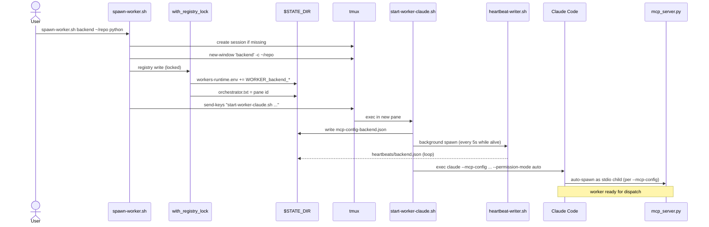
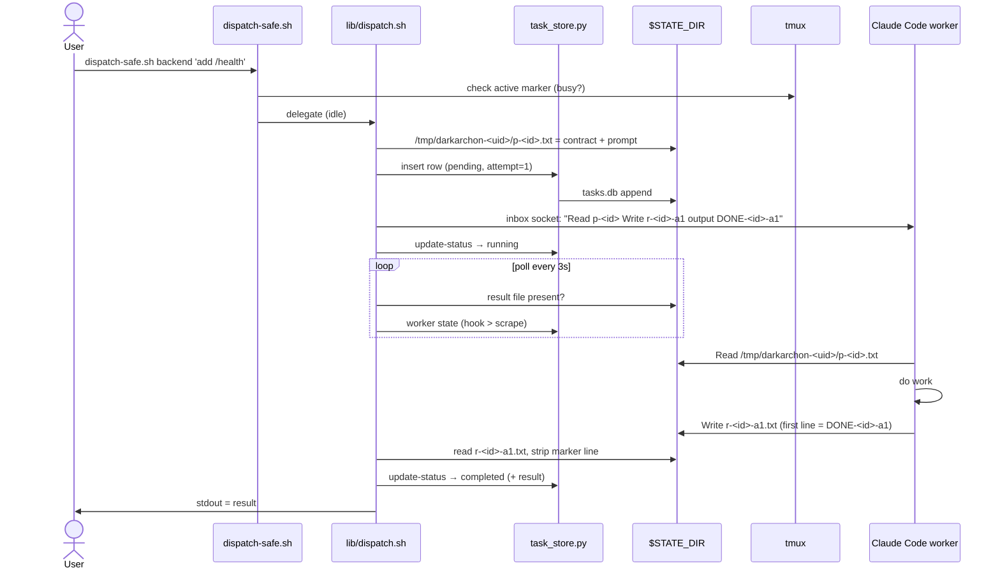
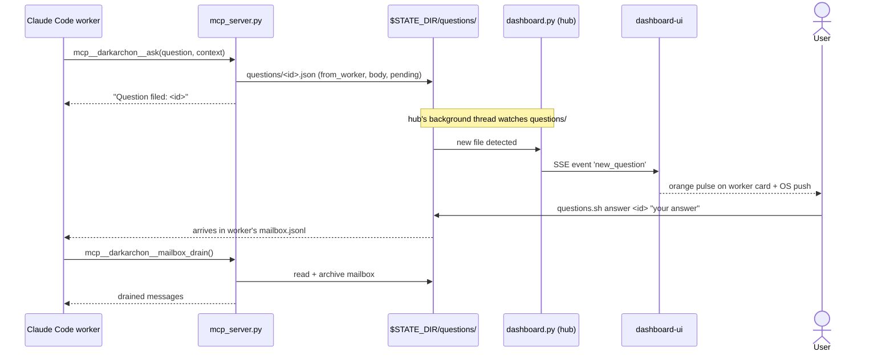
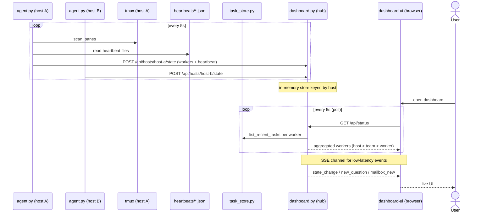

# darkarchon

Coordinate multiple coding-agent CLIs — [Claude Code](https://claude.com/claude-code) and [OpenAI Codex](https://github.com/openai/codex) — across **separate tmux windows and repositories**. Each worker is an independent `claude` (or `codex`) process with its own cwd, skills, plugins, and MCP servers. File-based message passing. Live dashboard. tmux-native.

> tmux window = isolated claude process · filesystem = message bus · short trigger over the worker's inbox socket (send-keys for codex)

Use when one claude session — or Claude Code's built-in `Task` sub-agent — can't cover the work. Sub-agents share the parent's cwd and `.claude/` config; darkarchon workers don't.

---

## Who this is for

If you've hit any of these walls, this tool was built for you.

### 1. You use Claude Code's `Task` tool, but your work spans multiple repositories

Sub-agents spawned by `Task` run inside the parent process — same cwd, same MCP config, same tool permissions. They can't open a sibling repo as if it were "their" workspace. darkarchon gives each worker its own tmux window started in its target repo, so a worker for `~/work/backend` has a fully independent `claude` session rooted there.

### 2. You can't use per-repo skills, plugins, or MCP servers across sub-agents

A `claude` session inherits the `.claude/` setup of its cwd — its skills, its plugins, its MCP server list. `Task` sub-agents reuse the parent's, so a skill installed for repo A is invisible when the sub-agent is asked to work in repo B. Each darkarchon worker is a **fresh `claude` process** started in its repo, which picks up that repo's `.claude/` natively.

### 3. You already have a Claude Code session running and don't want to throw it away

`invite-worker.sh <name> <session:window>` registers an existing pane as a worker without respawning it. The dashboard tracks it, dispatch routes to it, but the running conversation (and its `/compact` history) is preserved.

### 4. You live in tmux and find external UIs heavy

darkarchon is shell scripts + a small Python hub. Workers are `claude` processes in tmux windows you can `Ctrl-b w` to. The dashboard is **optional** — `lib/tasks.sh` and `questions.sh` give you the same data on stdout when you'd rather not leave the terminal.

### 5. You run multiple Claude Code instances and just want simple monitoring

`dashboard.sh start` → open `http://localhost:5173`. Every worker on every host you've started an agent on shows up, grouped by host → team, with live state (idle / busy / awaiting / rate_limited / compacting / dead). OS push when a worker needs you. No accounts, no cloud, no telemetry.

---

## Why this exists

Claude Code's built-in `Task` tool spawns sub-agents inside the same process. They share the parent's cwd, MCP config, and tool permissions. That's enough for most tasks, but breaks down when:

- you need to touch **multiple repositories** in parallel (each with its own `.claude/` config)
- a worker needs to run for hours independently while you work on something else
- you want to **see** what every worker is doing at once

darkarchon gives each worker its own tmux window — a full, independent claude process — and orchestrates them through small files on disk. A web dashboard streams every worker's state in real time.

---

## Install via Claude Code (recommended)

Open a Claude Code session in any directory and paste:

```
Install darkarchon from https://github.com/lopiter/darkarchon following its README quick start.

- Ask me where to clone it (default: ~/work/darkarchon). Clone there if it isn't
  already present, and use that path as DARKARCHON_HOME everywhere below.
- Run <clone-dir>/install.sh — it symlinks the darkarchon-team skill into
  ~/.claude/skills/ and appends DARKARCHON_HOME to my shell rc. If it doesn't fit
  my environment (fish, custom rc), reproduce those two effects by hand instead.
- Run `pip install --user mcp` to enable native MCP tools inside workers
- Verify with `python3 -c "import mcp; print('ok')"` and `ls -la ~/.claude/skills/darkarchon-team`
- Do NOT start the dashboard / agent / any worker yet — I'll do that manually
- Print a one-line summary of what changed at the end
```

Claude reads the rest of this README, decides which shell rc (`~/.zshrc` / `~/.bashrc`) you actually use, and adapts to your Python setup (system / pyenv / venv). One-shot install on most macOS / Linux setups.

`install.sh` is idempotent — re-run it any time; a real directory already at the
skill destination is backed up (`.bak.<timestamp>`), never deleted.

For a step-by-step manual install, see Quick start below.

### Drive it with natural language (skill)

You don't have to memorize the scripts. `skills/darkarchon-team/SKILL.md` is a
[Claude Code skill](https://docs.claude.com/en/docs/claude-code/skills) gated on
the phrase **"dark team"** — a bare "team" means Claude Code's native teams, so
the explicit phrase keeps the two from colliding. Say "create a dark team" and
Claude surveys your open tmux windows and asks which ones to enlist; say
"invite 10:1 to the dark team" to register a single pane. Once the context is
active, follow-ups like "have backend add a health endpoint" or "stop the team"
route to the right darkarchon commands. `install.sh` symlinks the skill into
`~/.claude/skills/darkarchon-team`, so `git pull` keeps it current — no
re-copying.

Want to tailor the team-naming / project conventions to your own setup? Replace
the symlink with a real copy under a different name (e.g.
`~/.claude/skills/my-team/`) and edit away; the bundled skill then serves as the
upstream reference.

---

## Quick start

```bash
# 1. clone (pick any directory you like; ~/work/darkarchon is just a convention)
git clone https://github.com/lopiter/darkarchon ~/work/darkarchon

# 2. shell rc
export DARKARCHON_HOME=~/work/darkarchon

# 3. (optional) install the python mcp SDK — enables native MCP tools
#    inside workers. Without this, workers fall back to invoking the
#    legacy ask.sh / mailbox.sh commands via Bash.
pip install --user mcp

# 4. spawn a worker (creates tmux window 'backend' in session $DARKARCHON_TEAM)
$DARKARCHON_HOME/lib/spawn-worker.sh backend ~/projects/backend python

# 5. dispatch a task and wait for the result
$DARKARCHON_HOME/dispatch-safe.sh backend 'add a /health endpoint that returns ok'

# 6. (optional) start the dashboard
$DARKARCHON_HOME/dashboard.sh start        # hub + local agent; hub on http://localhost:8765 + hash(team) % 100
$DARKARCHON_HOME/dashboard-ui.sh start     # ui on http://localhost:5173 (npm install runs once if needed)
# then open http://localhost:5173 — the UI proxies /api to the hub port automatically
```

`spawn-worker.sh` creates the tmux session on demand if it doesn't exist. The worker runs `claude --permission-mode auto`, reads its role prompt from `prompts/`, and (when `mcp` is installed) loads the darkarchon MCP server as a child process.

> **First worker on a new folder?** Claude Code shows a one-time *"Is this a
> project you trust?"* prompt before it starts, so the worker looks stuck and
> the first dispatch will refuse it as not-yet-idle. Switch to the window
> (`Ctrl-b w`, pick the worker) and press **Enter** once to confirm. This is per
> repo/folder — subsequent spawns in the same folder skip it.

### Claude or Codex workers

Workers can be either Claude Code or OpenAI Codex. Pass `--kind` to `spawn-worker.sh`
(default `claude`); `invite-worker.sh` auto-detects the kind from the pane and
takes `--kind` only to override.

```bash
# spawn a Codex worker (needs the `codex` CLI installed + `codex login`)
$DARKARCHON_HOME/lib/spawn-worker.sh --kind codex reviewer ~/projects/backend review
# dispatch + dashboard are identical regardless of kind
$DARKARCHON_HOME/dispatch-safe.sh reviewer 'review the latest changes'
```

Codex workers launch as a persistent `codex --dangerously-bypass-approvals-and-sandbox`
TUI (no `codex exec`). The dispatch contract is the same one-line trigger; the
worker's kind is recorded in the registry so dispatch, busy-detection, and the
dashboard route to the right per-agent logic. Two notable differences from Claude:

- **No launch-time prompt / MCP injection.** Codex has no `--append-system-prompt`
  or `--mcp-config`; the team contract isn't written into the repo, and peer
  tools fall back to the legacy `ask.sh` / `mailbox.sh` path (MCP-less).
- **Same-cwd serialization.** A Claude dev worker and a Codex reviewer can share
  one repo — `dispatch-safe.sh` refuses a dispatch while a *same-cwd peer* is
  busy, so the two never edit the working tree concurrently.

---

## How it works

```
┌──────────────────────────────────────────────────────────────┐
│                        your machine                          │
│                                                              │
│  tmux session ($DARKARCHON_TEAM)                             │
│  ┌──────────┐  ┌──────────┐  ┌──────────┐                    │
│  │ worker A │  │ worker B │  │ worker C │   (claude --auto)  │
│  └────┬─────┘  └────┬─────┘  └────┬─────┘                    │
│       │             │             │                          │
│       │ writes tasks/, mailbox/, questions/ files            │
│       ▼             ▼             ▼                          │
│  ~/.darkarchon/$DARKARCHON_TEAM/{tasks, mailbox, ...}        │
│       ▲                                                      │
│       │ scans every 5s + tails tmux panes                    │
│  ┌────┴─────┐                ┌────────────┐                  │
│  │  agent   │ ── POST ──▶    │   hub      │ ── SSE ──▶ ui    │
│  └──────────┘                └────────────┘                  │
└──────────────────────────────────────────────────────────────┘
```

- **agent** (`agent.py`) — per-host process that scans tmux for claude panes, captures their state, merges in heartbeat freshness, and POSTs to the hub.
- **hub** (`dashboard.py`) — aggregator. Stores state by host, broadcasts SSE events, serves the React UI. Queries `tasks.db` for dispatch history.
- **dashboard-ui** — React + Vite app at `dashboard-ui/`. Subscribes to `/api/events` (SSE) and polls `/api/status` as a fallback.
- **dispatch** — writes a task row to `tasks.db`, sends a short trigger, then tails the result file. State transitions (pending → running → completed/failed/timeout) are validated by the SQLite task store.
- **trigger transport** (`peer_post` in `lib/_lib.sh`) — a claude worker's trigger is posted to its [cross-session messaging](https://code.claude.com/docs/en/cross-session-messaging) inbox socket, whose path `lib/state-hook.sh` records from `CLAUDE_CODE_MESSAGING_SOCKET`. The receiver queues it while the worker is mid-turn, so the trigger can't collide with a user typing in the pane. codex workers, invited (EXTERNAL) workers, and any claude session without the feature fall back to `tmux send-keys`. Payloads still travel by file for both: the socket has no return channel a shell script can read, so the result file stays the completion signal — and a socket trigger is deduped if it repeats a message the receiver just took from the same sender, which is why every trigger carries a unique tag.
- **worker-side MCP server** (`lib/mcp_server.py`) — child of the claude process. Exposes `ask`, `mailbox_send`, `mailbox_drain`, `status_get` as native tools. Same on-disk format as the legacy sh helpers — both paths interoperate.
- **heartbeat writer** (`lib/heartbeat-writer.sh`) — another child of the claude process. Touches `heartbeats/<worker>.json` every 5s while alive; the agent marks the worker dead the moment the file goes stale or the pid disappears.
- **team index** (`lib/team_index.py`) — discovers every team state dir on a host and ages each one from the traces its tooling already leaves (dispatch, heartbeat, registry, mailbox). Built by each agent for its own machine and reported upward, since a state dir is only visible to the host holding it. Shared by the agent, the hub, and `lib/teams.sh`, so "which teams exist and which are abandoned" has one answer regardless of who asks — and `lib/teams.sh` can answer it with no hub running.
- **state resolver** (`lib/worker_state.py`) — the single source of truth for "what state is worker X in?", shared by `dispatch-safe.sh`, `check-worker-state.sh`, `wait-worker.sh`, and the dashboard agent. It layers three signals by reliability: heartbeat liveness (dead) > hook events > TUI scrape. No more drifting copies of busy/idle regex. The scrape layer is per-kind (`lib/detectors/{claude,codex,gemini}.py`); every kind also reads the tmux pane title (`#{pane_title}`), which all three CLIs publish state to and which survives both scrolling and a crowded screen (codex: braille spinner while working, "Action Required" while blocked; gemini: "✦ Working…" ↔ "◇ Ready"; claude: braille spinner ↔ "✳"). Claude Code's title was static when this resolver was written and now animates, but its idle glyph covers a blocked worker too, so for claude the title only corroborates `busy` and the screen still decides idle vs. awaiting-permission vs. unsent. Claude's screen layer also raises a `shells_running` flag that stops a live `busy` hook from being mistaken for idle while a foreground shell runs. `dispatch-safe.sh` additionally debounces idle (`IDLE_CONFIRMS`, default 3 consecutive reads) before firing.
- **state hook** (`lib/state-hook.sh`) — for spawned Claude workers, `start-worker-claude.sh` injects a per-worker hooks file via `claude --settings` (same out-of-repo pattern as the MCP config). Claude Code fires `UserPromptSubmit`/`Stop`/`Notification`/`PreCompact` and the hook records busy/idle/awaiting_user/compacting to `states/<worker>.json` — event-driven, so the resolver isn't guessing from screen scraping. Invited/codex/legacy workers have no hook file and fall back to scraping, unchanged.

See [DESIGN.md](DESIGN.md) for the dashboard visual spec.

---

## Sequence flows

Renders inline on GitHub (Mermaid). For local viewing, any Markdown
preview tool that handles Mermaid works.

### 1. Worker spawn



One spawn → 1 tmux window + 3 child processes (claude, heartbeat-writer, mcp_server). Same pid tree, die together.

### 2. Dispatch a task



Prompt / result travel via the filesystem; the trigger carries only the short "go" signal and the paths. That split predates the socket — it was forced by tmux's 200-char trigger budget, which still binds codex workers — but it outlives it, because the socket carries no reply a shell script can collect. The result file is what makes the answer readable by `dispatch.sh`, and what keeps a late answer from an earlier attempt out of the current one's slot. SQLite stores every state transition with state-machine validation.

### 3. Worker asks the user (MCP)



Worker never touches files directly. MCP tool → file → hub detects → SSE → UI. User's answer comes back via the mailbox file.

### 4. Dashboard data flow (multi-host)



Each host runs its own `agent.py`. The hub aggregates by host id. SSE for instant pulses, polling for the periodic refresh.

### Common substrate

All four flows write/read the same on-disk layout:

```
              $STATE_DIR (single source of truth)
              ├── workers-runtime.env
              ├── tasks.db (SQLite)
              ├── questions/<id>.json
              ├── mailboxes/<worker>.jsonl
              ├── heartbeats/<worker>.json
              └── .registry.lock
                        ▲
        ┌───────────────┼────────────────┐
        │               │                │
   worker side     observer side    user side
  (spawn/dispatch/  (hub/agent/      (questions.sh /
   mcp/heartbeat)    dashboard-ui)    direct dispatch)
```

tmux carries short triggers only; the filesystem is the message bus.

---

## Commands

| Script | Purpose |
|---|---|
| `lib/spawn-worker.sh [--kind claude\|codex] <name> <cwd> [role]` | Create a new tmux window and start a Claude or Codex worker in it (default claude) |
| `invite-worker.sh [--kind claude\|codex] <name> <session:window> [role]` | Register an existing Claude/Codex pane as a worker (no respawn; kind auto-detected) |
| `uninvite-worker.sh <name>` | Remove an invited worker from the registry (pane untouched) |
| `dispatch-safe.sh [--after <ids>] <name> '<prompt>'` | Send a task, get the result. Refuses if the pane looks busy; `--after` waits for other tasks first |
| `lib/dispatch.sh <name> '<prompt>'` | Same, without the busy-check |
| `lib/kill-worker.sh <name>` | Close the worker's tmux window and clean up the registry |
| `lib/deregister-worker.sh <name>` | Drop a worker from the registry, pane untouched. Refuses a live worker (`--force` overrides) |
| `revive-worker.sh <name> [--fresh\|--adopt] [--session-id <id>]` | Bring a dead worker back with its conversation (`claude --resume`); `--fresh` starts clean from its handover note, `--adopt` registers whatever agent is already in its old pane |
| `prune-workers.sh [--dry-run] [--yes]` | Drop every dead registration. Never kills a window |
| `lib/leave-team.sh --reason <r> --handover -` | Run BY a worker: resign, leave a handover note, tell the orchestrator |
| `lib/start.sh` | Start every worker in `WORKERS=()` (config.env) |
| `lib/stop.sh` | Kill the team's tmux session |
| `lib/tasks.sh list \| today \| failed \| show <id> \| result <id>` | Inspect task history |
| `lib/teams.sh list \| archive <team> \| archive --stale` | Grade every team by last activity; archive the unused ones (moves, never deletes) |
| `check-worker-state.sh <name>` | One-line state report — for orchestrators deciding whether to dispatch |
| `wait-worker.sh <name> [--until s1,s2] [--timeout SEC]` | Block until the worker reaches a state (default: `idle,awaiting_permission,awaiting_user`). Exit 0 reached / 2 timeout / 3 dead — dispatch, then wait, instead of polling pane text |
| `questions.sh list \| show <id> \| answer <id> "<text>"` | Read & answer worker-filed questions (`WAIT?` marks a blocked asker) |
| `lib/mailbox.sh outstanding <worker> \| renotify <worker>` | Find messages a worker never drained, and re-trigger it |
| `notify-watcher.sh [hub_url]` | Subscribe to hub SSE and emit macOS desktop notifications (terminal-notifier / osascript) |
| `dashboard.sh start \| stop \| status` | Start/stop hub + agent daemons (hub on `8765 + hash(team) % 100`) |
| `dashboard-ui.sh start \| stop \| status` | Start/stop the Vite UI on `5173`; auto-syncs its proxy to the hub port. This is the screen you actually open in the browser |
| `agent.sh start \| stop \| status` | Start/stop just the per-host agent |

**Worker-side tools** (called from inside a worker — via MCP when available, sh as fallback):

| MCP tool | Legacy sh equivalent | Purpose |
|---|---|---|
| `mcp__darkarchon__ask(question, context, blocking=False)` | `lib/ask.sh [--blocking] "<q>"` | File a question for the orchestrator; `blocking` waits for the answer |
| `mcp__darkarchon__mailbox_send(to, body)` | `lib/mailbox.sh send <to> "<b>"` | Send a peer message + notify recipient. `to` may be `@all`/`@idle`/`@claude`/`@codex`/`@cwd:<dir>` |
| `mcp__darkarchon__mailbox_drain()` | `lib/mailbox.sh read <self>` | Read & remove own pending messages (stamps `read_at`) |
| `mcp__darkarchon__status_get()` | (no equivalent) | Self-introspection (mailbox count, recent tasks) |

The MCP tools shell out to the same scripts rather than reimplementing them, so
the message format, group addressing and trigger protocol have exactly one
implementation.

**Dispatch exit codes** (`dispatch-safe.sh`):

| Code | Meaning |
|---|---|
| `0` | Dispatched and completed — result on stdout |
| `10` | Worker busy / compacting / rate-limited, or another dispatch is in flight |
| `11` | Unsent user input on the prompt line (`--force` overrides) |
| `12` | Codex auth/stream error — run `codex login` |
| `13` | A same-cwd peer worker is busy (edits are serialized) |
| `14` | Worker is blocked on a permission prompt or a question |
| `15` | Circuit breaker: repeated failures on this worker (`--force` overrides) |
| `16` | An `--after` dependency failed, was cancelled, or doesn't exist |
| `17` | Timed out waiting for an `--after` dependency |
| `1`/`2`/`3` | Passthrough from `lib/dispatch.sh` — bad args / timeout / no result |

Both write the same on-disk format under `$STATE_DIR/{questions,mailboxes}/`. The dashboard and `questions.sh` read either path identically — MCP is a more natural calling convention, not a different mechanism.

### Why two paths

Both reach the same files; what differs is how the worker calls them:

```
Legacy (sh, always available):                 MCP (when `pip install mcp` is present):

  worker claude                                  worker claude
       │  Bash tool                                   │  native tool call
       ▼                                              ▼
  /bin/sh fork                                   mcp_server.py (stdio child)
       │                                              │
       ▼                                              ▼
  ask.sh / mailbox.sh                            same write logic in Python
       │                                              │
       └────────────────────┬─────────────────────────┘
                            ▼
            $STATE_DIR/{questions,mailboxes}/...
                            │
                            ▼
                  hub + dashboard + questions.sh
                  (read identically either way)
```

Reasons to prefer MCP when available:

- **Tokens** — worker prompts don't need to teach the bash command shapes (~800 tokens saved per API call). Claude Code auto-injects the typed tool descriptions.
- **Latency** — stdio JSON-RPC ≈ 10× faster than fork + exec.
- **Reliability** — type-checked schema + structured errors vs. fragile stdout parsing.
- **Cleaner prompts** — the worker no longer has to remember quoting / escaping / exit code conventions.

Reasons the legacy sh path stays:

- **Zero new dependencies** — works without `mcp` package, useful for stripped-down environments.
- **Multi-LLM** — Codex workers (and other non-Claude CLIs) lack Claude Code's built-in MCP client, so the sh path is the only one available to them. Claude and Codex workers coexist in the same team because they share the on-disk file format.
- **Backward compat** — anything calling `ask.sh` / `mailbox.sh` directly (e.g. from `prompts/`-injected examples, ad-hoc shell sessions, or future tooling) keeps working unchanged.

---

## Configuration

Everything lives in `config.env` and is overridable by environment:

| Variable | Default | Purpose |
|---|---|---|
| `DARKARCHON_TEAM` | `default` | Team name. Becomes the tmux session name and parent of `~/.darkarchon/<team>/` |
| `DARKARCHON_PROMPT_DIR` | unset | Optional dir of project-specific prompts layered on top of generic `prompts/` |
| `CLAUDE_FLAGS` | `--permission-mode auto` | Passed to every spawned claude |
| `TASK_MAX_SECONDS` | `3600` | Hard cap on one dispatch before it's failed as a timeout |
| `POLL_INTERVAL` | `3` | Seconds between dispatch tail polls |
| `STRICT_RESULT_HEADER` | `0` | Reject a result whose first line isn't the dispatch's DONE marker (default: warn only) |
| `CIRCUIT_THRESHOLD` | `3` | Consecutive failed dispatches to one worker before refusing (`0` disables) |
| `DEPS_WAIT_SEC` | `3600` | How long `--after` waits for its dependencies |
| `MAILBOX_OUTSTANDING_SEC` | `300` | Age at which an undrained message is reported by `mailbox.sh outstanding` |
| `ASK_TIMEOUT_SEC` | `1800` | Default wait for a blocking `ask` |
| `TEAM_DORMANT_DAYS` | `7` | Days of inactivity before a team is graded `dormant` |
| `TEAM_STALE_DAYS` | `30` | Days of inactivity before a team is graded `stale` |

`TASK_TIMEOUT` still appears in `config.env` but nothing reads it — `TASK_MAX_SECONDS` replaced it.

The two `TEAM_*_DAYS` values only classify — nothing is ever deleted on their account. They feed the dashboard's age badges and pick the default set for `teams.sh archive --stale`; see [Team lifecycle](#team-lifecycle). Lower them if you spin up short-lived worktree teams and want the clutter surfaced sooner.

Per-shell isolation (recommended via [direnv](https://direnv.net/)):

```bash
# .envrc in your worktree / project dir
export DARKARCHON_TEAM=feature-x
```

Shells with different `DARKARCHON_TEAM` values land in different tmux sessions and write to different `STATE_DIR` — fully isolated. You can run several teams in parallel without collision.

---

## State directory layout

```
~/.darkarchon/
├── agent.config                  # hub URL + host id — per HOST, shared by all teams
└── <team>/
    ├── workers-runtime.env       # registry of spawned/invited workers
    ├── tasks.db                  # SQLite — every dispatch (status + result + history)
    ├── mailboxes/<worker>.jsonl  # inter-worker messages
    ├── questions/<id>.json       # worker→user clarifying questions
    ├── heartbeats/<worker>.json  # per-worker liveness (5s update, pid + last_seen)
    ├── states/<worker>.json      # last hook event + the Claude session id (what --resume needs)
    ├── departed/<worker>.json    # recall record: cwd/role/kind/session id of a worker that left
    ├── handovers/<worker>.md     # parting note, layered into the replacement's system prompt
    ├── mcp-config-<worker>.json  # generated per-spawn MCP server config
    ├── orchestrator.txt          # pane id of the session that spawned the team
    └── .registry.lock            # transient mkdir-lock for concurrent mutations
```

`agent.config` sits one level up because the agent is per-host, not per-team: it
scans every tmux pane on the machine and reports them under one `HOST_ID`. Run
exactly one agent per host — `agent.sh start` refuses when another is alive.

### How a pane is matched to its registration

`workers-runtime.env` records a worker's tmux `TARGET` as `session:window-name`, but a scanned pane reports `session:window-index.pane-index`. The resolver therefore tries several key shapes, in order:

1. `WINDOW_ID` — tmux's immutable handle for the window (`@5`)
2. the target as reported (`myteam:2.1`)
3. the same without the pane part (`myteam:2`)
4. `session:current-window-name` (`myteam:backend`)

Shapes 2–4 are all mutable. A window can be renamed, and tmux's `automatic-rename` does exactly that on its own: it follows `pane_current_command`, which for Claude Code is the runtime version string, so a window called `backend` silently becomes `2.1.220` and stops matching. Indices shift as windows are closed. Both spawn and invite therefore pin the name (`automatic-rename off`, `allow-rename off`) **and** record the window id, which survives both.

The id is checked against the session it was registered in before being trusted, because tmux reassigns ids from `@0` when its server restarts.

Registrations written before `WINDOW_ID` existed keep resolving by name — there is nothing to migrate, though re-inviting an external pane will add the id.

---

## Worker lifecycle: leaving, and coming back

A worker dies for ordinary reasons — the machine reboots, a turn wedges, its context fills up and someone kills it. What it leaves behind is a registration nobody can dispatch to, holding its name hostage. Getting it back used to mean editing `workers-runtime.env` by hand.

**Reviving.** Every spawned claude worker's session id is recorded by the state hook, so its conversation can be restored:

```bash
revive-worker.sh homepage-backend           # respawn in a NEW window, claude --resume
revive-worker.sh homepage-backend --fresh   # replacement starts clean (reads the handover note)
revive-worker.sh homepage-backend --adopt   # register the agent already running in its old pane
```

The revived worker is a fresh process with the charter, hooks, heartbeat and MCP tools reattached — the things a hand-relaunched `claude` in the same window does *not* have — plus the previous conversation.

**`--resume` is not always the right answer.** It restores the context exactly as it was, which is what you want after a reboot, and precisely wrong when the worker was killed *because* its context was full: resuming replays it straight back into the wall. For that case the worker should resign on its own way out:

```bash
# run by the worker, in its own pane
lib/leave-team.sh --reason context-full --handover - <<'EOF'
Migration 003 is applied and verified; 004 is written but untested.
The rollback path assumes the old column still exists — check that first.
EOF
```

That deregisters it (its pane keeps running — it can finish its sentence), files a departure notice on the question queue, and writes a handover note that `revive-worker.sh <name> --fresh` layers into the replacement's system prompt at launch. Knowledge transfers; the exhausted context does not.

**Nothing here kills a window.** A dead worker means "nobody answers for this name" — it says nothing about the pane, which someone may have relaunched their own session in. The resolver reports that case as `dead` with `orphaned=1`, dispatch refusals name it explicitly, and `prune-workers.sh` clears the ghost registration while leaving the live session alone. `lib/kill-worker.sh` remains the only command that destroys a window, and it is never what a dead worker calls for.

Every removal path (`kill`, `uninvite`, `deregister`, `leave`) first writes a recall record to `departed/<worker>.json` holding the cwd, role, kind and session id — so a worker can be brought back long after its registration is gone.

## Team lifecycle

State dirs accumulate. Every worktree, every experiment, every one-off team leaves one behind, and nothing removes them — a year in, `~/.darkarchon/` holds dozens of directories and no record of which still matter.

Rather than guess at "dead", darkarchon reports **when a team was last active and which signal says so**, and leaves the call to you.

Last activity is the newest of four traces the tooling already leaves:

| Signal | Means |
|---|---|
| `dispatch` | newest row in `tasks.db` |
| `heartbeat` | a worker was running (`heartbeats/*.json`) |
| `registry` | a spawn / kill / invite changed `workers-runtime.env` |
| `mailbox` | a worker-to-worker message was written or drained |

The winning signal is reported alongside the age, because "quiet for 40 days since its last dispatch" and "registered last week, never given work" are different situations that a bare timestamp collapses together.

Teams are then graded — `live` (a worker is running now) → `recent` → `dormant` → `stale`, using the `TEAM_*_DAYS` thresholds above. `empty` is separate: no registered workers at all, meaning it was torn down cleanly rather than abandoned.

```bash
lib/teams.sh list                      # grade every team
lib/teams.sh list --json               # same, machine-readable
lib/teams.sh archive <team> [<team>…]  # move specific teams aside
lib/teams.sh archive --stale           # move everything graded 'stale'
lib/teams.sh archive --inactive        # move everything with nothing running
lib/teams.sh archive --inactive --yes  # skip the confirmation prompt
```

```
TEAM                         TIER       IDLE LAST SIGNAL  WORKERS   SIZE
small-star                   live         0m heartbeat          2   576K
aff                          recent       2d registry           5   213K
secu                         dormant     11d dispatch          29   856K
perf                         stale       49d dispatch           2    57K

  dormant=12  empty=1  live=1  recent=10  stale=5
  thresholds: dormant >7d, stale >30d
```

`--inactive` is the wider net — every team not currently `live`, which is exactly what the dashboard lists. `--stale` is the subset that has also been quiet past `TEAM_STALE_DAYS`. A target may be a team name, or a path: a worktree team named `myteam-feature-x` lives at `myteam/feature-x`, so only the path finds it.

**Archiving moves, it never deletes.** A team goes to `~/.darkarchon-archive/<date>/<team>/` with its `tasks.db` history intact; restore it by moving the directory back. Three refusals protect you, and a refusal skips that team rather than aborting the batch:

- a team whose tmux session is still alive
- the team your current shell belongs to (`DARKARCHON_TEAM`)
- a destination that already exists

Archiving is CLI-only on purpose. The hub exposes the index read-only at `/api/teams` (and inside `/api/status`), so nothing reachable over the network can move a team's history.

In the dashboard, a team that has gone quiet carries its age beside the name, and teams with nothing running collapse into an `inactive teams (N)` row at the bottom rather than crowding the ones you're working in. That list is grouped by host and each group has a **copy archive-all** button (plus one per row) that yields a ready-to-run `teams.sh archive` command for that host — the dashboard never archives anything itself, because only the shell on that machine can check whether a tmux session is still alive.

`tasks.db` is the source-of-truth — query via `lib/tasks.sh` or any SQLite client. The plain-file siblings let you inspect / delete with `cat` / `ls` when needed.

---

## Dashboard

The React UI shows every worker grouped by host → team, with live state badges (idle, busy, awaiting_user, rate_limited, dead) and OS push notifications when a worker needs you. Desktop only. Dummy data mode (`VITE_USE_DUMMY=1`) available for visual development without a running hub.

Two views, toggled by the bottom-left pill (persisted):

- **Graph** (default) — canvas tree of host → orchestrator → workers. Busy workers glow with a live spinner, in-flight dispatches stream particles from the actual sender (resolved from `incoming_dispatches[].label`), and `spawned_by` lineage (registry `WORKER_<sn>_SPAWNED_BY`, recorded automatically from `$EE_WORKER_NAME` when an orchestrator/hermes calls `spawn-worker.sh`, or via `--spawned-by`) renders as a dashed violet link — so hermes-spawned orchestrators stay visibly attached to hermes even across teams. Space+drag pans, scroll zooms, click opens the detail panel.
- **Cards** — the compact row layout, light/dark themed.

---

## Multi-host setup

Run one hub and one agent per machine. The hub aggregates everyone's view; each agent reports its own host's tmux.

### Hub host (one machine — usually the one you sit in front of)

| Component | Why |
|---|---|
| `dashboard.sh start` | runs the hub (HTTP + SSE) AND the local agent |
| `dashboard-ui.sh start` (`npm run dev` under the hood, or serve a built bundle) | the browser-side UI on `5173` |
| optional: `notify-watcher.sh` | macOS desktop notifications |

Defaults are fine on a single-LAN home network. The hub binds to `0.0.0.0` so other hosts can POST.

### Agent host (every other machine you want visible)

| Component | Why |
|---|---|
| `agent.sh start` | scans this machine's tmux + heartbeats, POSTs to the hub |

`~/.darkarchon/agent.config` (auto-created on first start) needs `HUB_URL` pointing at the hub host's LAN IP — e.g. `HUB_URL=http://192.168.x.x:8774`. The hub never reaches back; the agent always initiates.

One agent covers the whole machine, whatever `DARKARCHON_TEAM` the shell had — it scans all of tmux and sweeps every team under `~/.darkarchon/` for registry, heartbeat and hook state. Starting it again from a different team's shell is a no-op, not a second agent.

The agent also builds its host's [team index](#team-lifecycle) and sends it up with the worker report. Only that host can see its own state dirs, so the index has to travel — a hub reading its own disk would leave every remote host's teams ungraded, and would hand a team's age to whichever *other* machine happened to have a directory of the same name. Teams are therefore identified by `(host, team)` throughout; two machines may each have an unrelated `voc`.

### What stays host-local (does NOT cross hosts)

- `dispatch` (tmux-driven — sender's tmux can't reach the other host)
- `mailbox` / `questions` (filesystem-based — each host has its own `$STATE_DIR`)
- `tasks.db`, `heartbeats/`
- team state dirs — each agent grades its own and reports the result; the hub never reads another machine's disk

The hub only mirrors **what each agent reports about its own host**. Cross-host worker collaboration is currently a non-goal — workers are expected to operate on their host; the dashboard merely gives one observation point.

### Updating an agent host after pulling new features

When the maintainer ships new agent capabilities (heartbeat, MCP, SQLite, etc.), each agent host needs its own pull:

```bash
# on the agent host
cd ~/work/darkarchon
git pull   # whichever remote you cloned from

# optional — enables MCP tools inside spawned workers on this host
pip install --user mcp

# restart the agent so it loads the new code
./agent.sh stop
./agent.sh start

# workers spawned BEFORE the pull won't have the new wrappers
# (no heartbeat-writer / no MCP server child / no state hooks). To pick them up:
./lib/kill-worker.sh <worker>
./lib/spawn-worker.sh <worker> <cwd> <role>
```

Until an agent host is on the new code, workers it owns will show `heartbeat_age_sec=null` on the dashboard — the dashboard side falls back to plain tmux-scan inference for those, so they're still visible, just less accurate.

**Re-spawn to gain event-driven state.** Hook-based state reporting (accurate `busy`/`idle`/`awaiting_user` without TUI scraping) is injected at launch via `claude --settings`, so a running Claude session cannot be upgraded in place — Claude Code snapshots its hook config at startup and won't adopt an externally-added one mid-session. `kill-worker` + `spawn-worker` (above) gives the worker its state hooks. Workers you'd rather not restart keep working on the scrape fallback; the dashboard just labels their state `source=scrape` instead of `source=hook`. Invited workers (`invite-worker.sh`) are always scrape-based by design — they exist precisely to preserve a running conversation.

**Scratch path moved.** Dispatch prompt/result scratch files moved from the world-readable `/tmp/ee` to a per-user `/tmp/darkarchon-<uid>` (mode 700) so other users on a shared host can't read a worker's prompts. Nothing to migrate — the files are transient (the durable copy lives in `tasks.db`); an in-flight dispatch started under the old path is read back from its recorded path and completes normally.

---

## Project status

The core loop is stable. What works today:

- spawn / dispatch / kill / mailbox / ask end-to-end (sh + MCP both paths)
- multi-host (run `agent.sh` on each machine, point at one hub)
- dashboard with OS push notifications, dead/stale detection via heartbeats
- SQLite task store with state-machine-validated transitions
- mkdir-based registry lock — concurrent spawn/kill no longer race
- worktree isolation by `DARKARCHON_TEAM` (no implicit path inference)
- unified state resolver (`lib/worker_state.py`): heartbeat > hook events > scrape, one copy shared by dispatch + dashboard
- event-driven state for spawned Claude workers via injected hooks (no TUI-glyph guessing); scrape fallback for invited/codex workers
- per-worker + per-cwd dispatch locks — a busy-check and its dispatch are atomic, so two dispatchers can't double-fire
- result-file-first completion + activity-based timeout (nudge once on a contract-less turn-end, hard cap `TASK_MAX_SECONDS`) — long tasks no longer die at a flat 300s

Rough edges:

- prompt layering knobs (`DARKARCHON_PROMPT_DIR`) are minimally documented
- no install one-liner / brew formula; clone-and-export only
- agent and hub run as foreground daemons via `dashboard.sh` (no launchd/systemd integration)
- tests are not yet CI-wired (they pass locally: `python3 -m pytest`)

Built for working with multiple claude instances on cross-repo refactors without switching tmux windows by hand.

---

## License

[MIT](LICENSE) — use, modify, and distribute freely, including commercially. Just keep the copyright notice.
